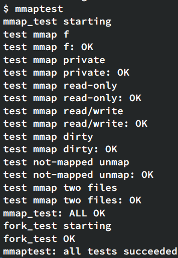

## Lab mmap
实现系统调用mmap子集功能

```c
void *mmap(void *addr, size_t length, int prot, int flags, int fd, off_t offset);
```

- addr永远为0，由内核决定分配哪个虚拟地址来映射文件，并且return该地址
- length是需要映射的长度，有可能和文件大小不同
- prot表示内存映射是否可读、可写、可执行；在这个lab里要么PROT_READ要么PROT_WRITE要么两者
- flags或为MAP_SHARED，表示对映射内存的改动要写回文件，或为MAP_PRIVATE，表示不写回
- fd是待映射文件的文件描述符
- 假定offset永为0，及从文件开头开始映射

以及配套的munmap(addr, length)，移除对应地址的映射，如果内存被修改且MAP_SHARED，改动首先要写回文件。可以假设munmap不会在一块内存映射的中间进行（要么开头，要么结尾，要么整块）

和上个lab一样，先添加mmap和munmap系统调用

惰性填充页表（lazy allocation），即先不实际分配物理地址，也不读文件，而是在page fault处理代码usertrap中进行，这样可以确保mmap大文件是足够快，也使得mmap一个大于物理内存的文件成为可能

在每个进程中用长度为16的定长数组维护mmap的内存，记录地址、长度、权限、文件等等

实现mmap，在进程的地址空间中找到未使用的区域（p→sz，虽然会和sbrk冲突就是了），添加VMA到上面的数组，还需要增加file的引用计数（filedup）

记得要检查权限，文件若不可读，则不能映射；文件若不可写，则flags标志位不能为MAP_SHARED（不能写回影响原文件）

实现缺页中断处理逻辑，检查目标地址是否在当前进程mmap VMA中，如果是，就kalloc()分配物理空间，mappages关联虚拟页和物理页（记得权限设置a→prot），然后调用readi将文件内容写入mmap映射空间，需要给inode加锁。

实现munmap：

- 如果移除了mmap一整块VMA，需要对对应的file ref count减1（fileclose）
- 如果移除前半或后半，更新address和length
- 遍历需要取消映射的页，如果该页被修改（PTE_D标志位dirty），且MAP_SHARED，需要首先调用filewrite写回文件再调用uvmunmap取消映射，注意需要判断pte是否有效（PTE_V），必须逐页unmap，因为可能中间有几页没有映射
- 更新VMA的address和length字段

修改exit函数，手动munmap所有mmap的区域

修改fork函数，保证子进程和父进程有相同的mmap映射（拷贝vma数组即可），同时需要注意使用filedup增加文件的ref count。这样一来，子进程也能正常访问mmap区域 。

