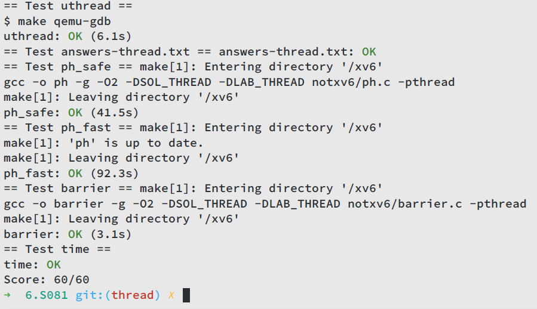

# Lab Multithreading

## Uthread: switching between threads

+ 实现用户态多线程的上下文切换
+ 测试线程循环打印一行并交出CPU
+ 要求修改`user/uthread.c`，完善`thread_create()` and `thread_schedule()`函数，以及`user/uthread_switch.S`，完善`thread_switch`
+ 要求线程在各自的栈执行`thread_create()`传入的函数
+ `thread_schedule()`需要调用`thread_switch`切换线程
+ `thread_switch`保存和恢复寄存器（callee-saved），存在`struct thread`中

### 实现

认真读过xv6 book多线程一章后还是有很多收获的，了解了上下文切换和线程的原理就比较好做了。首先给`struct thread`添加一个`context`，和xv6的`struct thread`存相同的寄存器，然后`thread_schedule`函数添加线程切换的函数，传入两个线程的context：

```c
thread_switch((uint64) &t->context, (uint64) &next_thread->context);
```

最后是`thread_create()`函数里面，初始化线程，设置`ra`（返回地址）为传入的函数的地址，设置`sp`（栈指针）为线程栈的结尾：

```c
  t->context.sp = (uint64) (t->stack + STACK_SIZE);
  t->context.ra = (uint64) func;
```

至于`uthread_switch.S`里的`thread_switch`，直接把xv6的`swtch`汇编代码搬过来即可。

## Using threads

+ 通过加锁实现线程安全的哈希表
+ 解释为什么初始版本多线程下`put()`会缺失键
+ 进阶：每个bucket单独加锁（读写不同的bucket无需对整个哈希表加锁）来加速哈希操作

### 实现

+ 每个bucket一个锁
+ 每次调用`insert()`前给对应的bucket加锁，调用返回之后解锁

（这个lab实现了一个简单的哈希表，还是很有参考价值的。）

## Barrier

+ 实现屏障：所有参与的线程需要等待其他线程到达同一位置（同步）
+ 利用`pthread_cond_t`实现
+ 完善`notxv6/barrier.c`
+ 预期效果：所有线程阻塞在`barrier()`，直到所有nthreads个线程都调用`barrier()`
+ 所有线程到达屏障后`bstate.round`加一

### 实现

```c
static void 
barrier()
{
	pthread_mutex_lock(&bstate.barrier_mutex); // acquire mutex
	bstate.nthread++;
	if(bstate.nthread < nthread)
        // go to sleep on cond, releasing lock mutex, acquiring upon wake up
		pthread_cond_wait(&bstate.barrier_cond, &bstate.barrier_mutex);
	else {
		bstate.round++; // increment round
		bstate.nthread = 0; // clear nthread
		pthread_cond_broadcast(&bstate.barrier_cond); // wake up every thread sleeping on cond
	}
	pthread_mutex_unlock(&bstate.barrier_mutex); // release mutex
}
```

> You have to handle the case in which one thread races around the loop before the others have exited the barrier. In particular, you are re-using the `bstate.nthread` variable from one round to the next. Make sure that a thread that leaves the barrier and races around the loop doesn't increase `bstate.nthread` while a previous round is still using it.

实际上，由于互斥锁的保护，不会出现上述情况，因为`pthread_cond_wait()`返回前会重新加锁，而此时互斥锁正在被第nthread个调用`barrier()`的线程使用，该线程对`bstate.round`加一、`bstate.nthread`清零后才会释放锁。

## 测评


