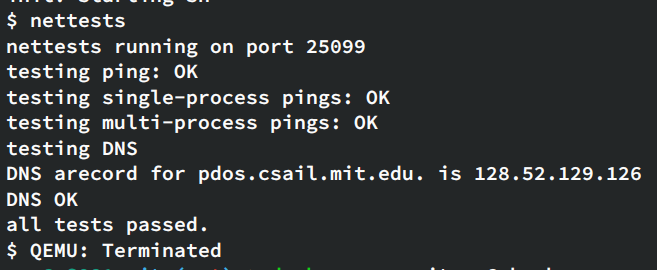

## Lab Network driver

实现82540EM网络驱动，主要是`e1000_transmit()` 和 `e1000_recv()` 这两个函数，在`kernel/e1000.c` 文件里。

读取和发送都利用DMA，都有环形缓冲

首先需要阅读英特尔的开发者手册，四百多页。。。

E1000看上去就像连接到LAN的硬件，xv6（qemu）的IP是10.0.2.15，宿主机IP是10.0.2.2

packets.pcap记录了所有的出入流量，可以使用**`tcpdump -XXnr packets.pcap`** 查看

一些文件：

- kernel/e1000.c：E1000初始化、发包、收包
- kernel/e1000_dev.h：E1000相关寄存器和标志位
- kernel/net.c&kernel/net.h：简易网络栈，实现IP、UDP、ARP等协议，以及mbuf环形缓存
- kernel/pci.c：在PCI bus查找E1000网卡

e1000_init()函数初始化E1000，允许DMA读写，分配环形缓冲区mbufs，同时还需要descriptors去描述这些缓存（用于DMA）。

e1000_transmit()需要让descriptor指针指向待发送mbuf数据，E1000传输完成后，会将descriptor的E1000_TXD_STAT_DD置位，这时需要释放这个mbuf

E1000收包后，DMA到RX_ring descriptor指向的mbuf，然后发起中断，最终e1000_recv()被调用，扫描RX ring，将每个mbuf传入net_rx()交由网络栈，还需要重新分配一个mbuf给当前的descriptor。

还需要与memory-mapped control registers交互，检测是否收到包，提示E1000可以发包。关注E1000_RDT和E1000_TDT

实现e1000_transmit()：

- 通过E1000_TDT得到TX ring索引
- 检查descriptor的status的E1000_TXD_STAT_DD是否置位（Descriptor Done），表示这个descriptor指向的上一个包已发送
- 调用mbuffree()释放该descriptor指向的mbuf（如果有）
- 将待发送的mbuf信息填入当前的descriptor，addr、length、cmd
- 需要另一个数组存储mbuf地址，以便之后正确释放
- 更新 tx ring index
- **需要加锁**

实现e1000_recv()：

- 循环通过E1000_RDT+1得到下一个包的索引
- 类似的，通过E1000_RXD_STAT_DD校验是否有包
- 更新mbuf的len，调用net_rx()交由网络栈处理
- 分配新的mbuf给当前descriptor
- 更新E1000_RDT

