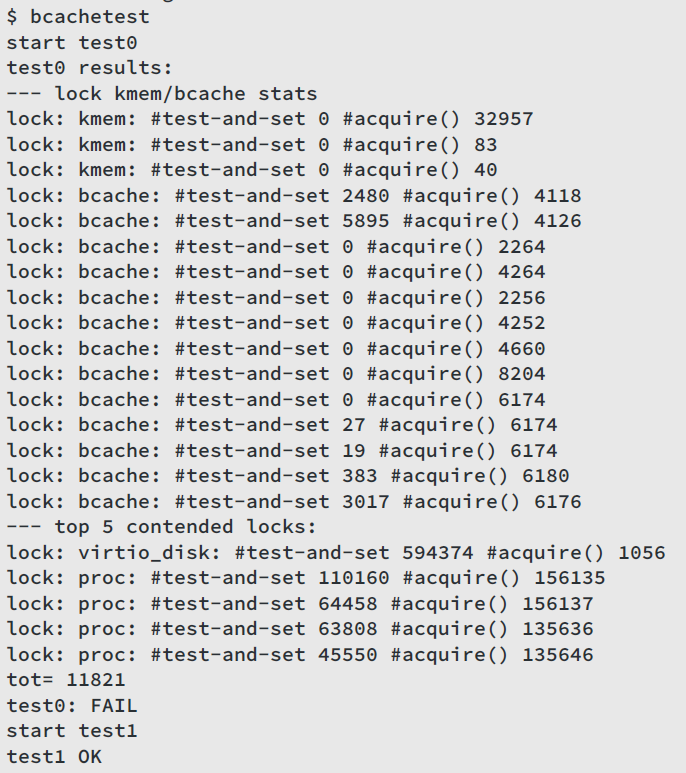

# Lab locks

## Memory allocator

+ 三个进程不断收缩地址空间，于是会不断调用`kalloc`和`kfree`，它们均会获取`kmem.lock`锁
+ `acquire`会记录：
  + 每个锁被获取的次数
  + 循环尝试获取锁的次数
+ 最后打印`kmem`和`bcache`的锁的信息，以及5个竞争最多的锁的信息
+ 本次assignment中锁竞争的根源为，`kalloc`访问free链表，而该链表由锁保护，各个CPU均需要获取这个锁
+ 因此需要为每个CPU单独维护free链表
+ 如果出现一个CPU的free链表空了，而另一个CPU的free链表还有空闲内存，则需要从该CPU“窃取”

### 实现

将原有单链表实现改为链表数组，元素个数为`NCPU`，`kinit`、`kfree`和`kalloc`均修改为以`cpuid`为下标访问对应free链表即可。

```c
struct freelist_per_cpu {
	struct spinlock lock;
	struct run *freelist;
};

struct {
  struct freelist_per_cpu freelists[NCPU];
} kmem;
```

需要注意，如果当前CPU的free链表为空，需要遍历所有free链表，从还有空闲内存的CPU处窃取

```c
  if(!r) {
	  for (int i=0; i< NCPU; i++) {
		  if (i==id)
			  continue;
		  acquire(&kmem.freelists[i].lock);
		  r = kmem.freelists[i].freelist;
		  if(r)
			  kmem.freelists[i].freelist = r->next;
		  release(&kmem.freelists[i].lock);
		  if(r)
			  break;
	  }
  }
```

### 测评


## Buffer cache

+ 目前bcache锁的粒度太粗，需要使用更细粒度的锁避免竞争
+ 改用哈希表替代双链表，每个bucket单独加锁
+ 使用时间戳记录bucket最后一次使用时间，以此避免使用双链表实现LRU

### 实现

将双链表改为哈希表，每个bucket有若干buf：

```c
#define NBUCKET 13
#define BUCSZ 10

struct bucket {
   struct spinlock lock;
   struct buf bufs[BUCSZ];
};

struct {
   struct spinlock lock;

   struct bucket bucs[NBUCKET];
} bcache;
```

一开始是打算采用开放寻址法解决哈希冲突问题的，然而debug了很久还是有各种各样的问题（`panic: ilock: no type`、`freeing free block`、`chdir failed`等等），最后还是采用了算是链式地址法的方法，虽然只是简单地用了数组来解决。

### 测评



### 参考链接

+ https://juejin.cn/post/7021218568226209828
+ https://zhuanlan.zhihu.com/p/433944490